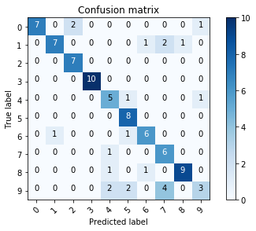

## Develop an AI model to classify the digits extracted from Covid-19 Screening Form.
1. Introduction
2. Project 3 - AI Model Intro
3. Data preparation
    - Load data
    - Data Preprocessing
4. AI Model
    - Define the model
    - Evaluate the model
    - Data augmentation
6. Prediction
    - Collect test images 
    - Preprocessing
    - Predict the test images


### 1. Introduction

This code is a part of Project 3 of Tennessee Tech Hackathon (April 17-19, 2020) that was aimed at building tools to help with the Covid-19 pandemic. The project focuses on data collection at COVID-19 testing sites. The project ideas were developed in consultation with people at Vanderbilt University Medical Center (VUMC) and the University of Texas, Austin (UT). 
 
The underlying problem is that the testing sites are largely using paper to collect information from patients coming in for tests, and the data needs to be extracted from those paper forms before researchers can to do any analysis. Additionally, the test site forms are not standardized; therefore, a solution for one test site’s form doesn’t work for other test sites’ forms.

Attached is the sample form from VUMC. 
<div>
<a url="Sample_filled_in_form.jpg"></a>
</div>

**Project 1**: Build a web-based repository to collect and organize blank forms from testing sites across the country. This will help researchers better understand the nature and scope of the data being collected. 
 
**Project 2**: Build tool to support image processing of forms filled in by hand that extract handwritten digits from pixel regions for processing by an AI for interpretation.

**Project 3**: Develop an AI to work with and classify the text extracted in Project 2. 

#### This notebook focuses on Project 3  and we are using standalone Keras running on top of TensorFlow with Python 3.

### 2. Project 3- AI Model Intro

We focus on classifying digit extracted from physical examination section of covid-19 screening form. We plan to train the AI model on [MNIST Handwritten Digit dataset](https://en.wikipedia.org/wiki/MNIST_database) and predict the text extracted from covid-19 form. MNIST is a dataset of 60,000 small square 28×28 pixel grayscale images of handwritten single digits between 0 and 9.

### 3. Data Preparation
**3.1 Load Dataset**


```python
from keras.datasets import mnist
from keras.utils import to_categorical
from matplotlib import pyplot
import seaborn as sns

# load dataset
(train_x, train_y), (val_x, val_y) = mnist.load_data()
# summarize loaded dataset

print('Train: X=%s, y=%s' % (train_x.shape, train_y.shape))
print('Validation: X=%s, y=%s' % (val_x.shape, val_y.shape))

# plot first few images
for i in range(9):
    # define subplot
    pyplot.subplot(330 + 1 + i)
    # plot raw pixel data
    pyplot.imshow(train_x[i], cmap=pyplot.get_cmap('gray'))
# show the figure
pyplot.show()
```

    Train: X=(60000, 28, 28), y=(60000,)
    Validation: X=(10000, 28, 28), y=(10000,)


We can see that the images are all pre-aligned (e.g. each image only contains a hand-drawn digit), that the images all have the same square size of 28×28 pixels, and that the images are grayscale.

**3.2 Data Preprocessing**

* We can reshape the data arrays to have a single color channel.
* We can use a one hot encoding for the class element of each sample, transforming the integer into a 10 element binary vector with a 1 for the index of the class value, and 0 values for all other classes. This can be done using to_categorical() utility function.
* The pixel values for each image in the dataset are unsigned integers in the range between black and white, or 0 and 255. We can normalize the pixel values of grayscale images, e.g. rescale them to the range [0,1]. This can be done by converting the data type from unsigned integers to floats, then dividing the pixel values by the maximum value.


```python
# reshape dataset to have a single channel
train_x = train_x.reshape((train_x.shape[0], 28, 28, 1))
val_x = val_x.reshape((val_x.shape[0], 28, 28, 1))

# one hot encode target values
train_y = to_categorical(train_y)
val_y = to_categorical(val_y)

 # convert from integers to floats
train_x = train_x.astype('float32')
val_x = val_x.astype('float32')

# normalize to range 0-1
train_norm = train_x / 255.0
val_norm = val_x / 255.0
```

### 4. AI Model
#### 4.1 Define the AI Model:
Convolutional neural network is the go-to model for image classification.
Therefore, we define the AI model based on CNN. The model has two main aspects: 
1. **The feature extraction front end**:
    For the feature extraction front end, we can start with a single convolutional layer with a small filter size (3,3) and a modest number of filters (32) followed by a max pooling layer. To make it deeper we add two other layer of CNN with 64 filters. The filter maps can then be flattened to provide features to the classifier.
2. **The classifier backend**:
    The backend will make a prediction. Given that the problem is a multi-class classification task, we know that we will require an output layer with 10 nodes in order to predict the probability distribution of an image belonging to each of the 10 classes. This will also require the use of a softmax activation function. Between the feature extractor and the output layer, we can add a dense layer to interpret the features, in this case with 100 nodes.

All layers will use the ReLU activation function and the He weight initialization scheme, both best practices.

We will use a conservative configuration for the stochastic gradient descent optimizer with a learning rate of 0.01 and a momentum of 0.9. The categorical cross-entropy loss function will be optimized, suitable for multi-class classification, and we will monitor the classification accuracy metric, which is appropriate given we have the same number of examples in each of the 10 classes.

The get_model() function below will define and return this model.


```python
from keras.models import Sequential
from keras.layers import Conv2D, Dense, Flatten, Lambda, Dropout
from keras.layers import Convolution2D, MaxPooling2D, BatchNormalization
from keras.layers.normalization import BatchNormalization
from keras.optimizers import SGD, Adam
from keras import models

def get_model():
    model = Sequential()
    model.add(Conv2D(32, (3, 3), activation='relu', kernel_initializer='he_uniform', input_shape=(28, 28, 1)))
    model.add(MaxPooling2D((2, 2)))
    model.add(Conv2D(64, (3, 3), activation='relu', kernel_initializer='he_uniform'))
    model.add(Conv2D(64, (3, 3), activation='relu', kernel_initializer='he_uniform'))
    model.add(MaxPooling2D((2, 2)))
    model.add(Flatten())
    model.add(Dense(100, activation='relu', kernel_initializer='he_uniform'))
    model.add(Dense(10, activation='softmax'))
    # compile model
    opt = SGD(lr=0.01, momentum=0.9)
    model.compile(optimizer=opt, loss='categorical_crossentropy', metrics=['accuracy'])
    return model
```

#### 4.2 Evaluate the Model
We will train the baseline model for a modest 10 training epochs with a default batch size of 32 examples. 
The save the result during each epoch of the training run, so that we can later create learning curves, and at the end of the run, so that we can estimate the performance of the model. As such, we will keep track of the resulting history from each run, as well as the classification accuracy of each epoch.


```python
def plot_train_result(history):
    plt.subplot(2, 1, 1)
    plt.title('Cross Entropy Loss')
    plt.plot(history.history['val_loss'], color='orange', label='test')
    # plot accuracy
    plt.subplot(2, 1, 2)
    plt.title('Validation Accuracy')
    plt.plot(history.history['val_acc'], color='orange', label='test')
    plt.show()
    
# evaluate model
model = get_model()
histories = model.fit(train_norm, train_y, epochs=10, batch_size=32, verbose=1, validation_data=(val_norm, val_y),)
# learning curves
plot_train_result(histories)
```

    Train on 60000 samples, validate on 10000 samples
    Epoch 1/10
    60000/60000 [==============================] - 89s 1ms/step - loss: 0.1253 - acc: 0.9607 - val_loss: 0.0588 - val_acc: 0.9808
    Epoch 2/10
    60000/60000 [==============================] - 94s 2ms/step - loss: 0.0431 - acc: 0.9865 - val_loss: 0.0326 - val_acc: 0.9892
    Epoch 3/10
    60000/60000 [==============================] - 106s 2ms/step - loss: 0.0276 - acc: 0.9914 - val_loss: 0.0288 - val_acc: 0.9912
    Epoch 4/10
    60000/60000 [==============================] - 82s 1ms/step - loss: 0.0201 - acc: 0.9937 - val_loss: 0.0328 - val_acc: 0.9897
    Epoch 5/10
    60000/60000 [==============================] - 86s 1ms/step - loss: 0.0160 - acc: 0.9948 - val_loss: 0.0265 - val_acc: 0.9908
    Epoch 6/10
    60000/60000 [==============================] - 86s 1ms/step - loss: 0.0116 - acc: 0.9964 - val_loss: 0.0345 - val_acc: 0.9890
    Epoch 7/10
    60000/60000 [==============================] - 88s 1ms/step - loss: 0.0104 - acc: 0.9965 - val_loss: 0.0258 - val_acc: 0.9923
    Epoch 8/10
    60000/60000 [==============================] - 91s 2ms/step - loss: 0.0082 - acc: 0.9973 - val_loss: 0.0252 - val_acc: 0.9924
    Epoch 9/10
    60000/60000 [==============================] - 94s 2ms/step - loss: 0.0058 - acc: 0.9982 - val_loss: 0.0273 - val_acc: 0.9926
    Epoch 10/10
    60000/60000 [==============================] - 92s 2ms/step - loss: 0.0042 - acc: 0.9986 - val_loss: 0.0304 - val_acc: 0.9919


### 5. Prediction
#### 5.1 Collect Test Image
The collection of digit extracted from covid-19 screening form are the test images.
We first load the test image.


```python
import cv2
import glob
import matplotlib.cm as cm
test_image = [file for file in glob.glob("test_data/*.png")]
# plot first few test images
for i in range(9):
    # define subplot
    pyplot.subplot(330 + 1 + i)
    # plot raw pixel data
    img = cv2.imread(test_image[i])
    pyplot.imshow(img, cmap=pyplot.get_cmap('gray'))
# show the figure
pyplot.show()

```


#### 5.3 Preprocessing

1. Read as grayscale
2. Invert color to black(background) and white (foreground) like MNIST
3. Resize to 28x28 pixel
4. Reshape to single channel
5. Normalize/scaling


```python
import numpy as np
def load_test_image(test_image):
    #read as grayscale and invert color
    img = (255 - cv2.imread(test_image, 0))
    #resize to 28x28 pixel
    image = cv2.resize(img, (28, 28))
    img = np.array(image)
    #reshape to single channel
    img = img.reshape(1, 28, 28, 1)
    # Normalize data
    img = img.astype('float32')
    img = img / 255.0
    return img
```

#### 5.3 Predict Test Image


```python
from sklearn import metrics
import matplotlib.pyplot as plt
import pandas as pd
import itertools

def plot_confusion_matrix(cm, classes,
                              normalize=False,
                              title='Confusion matrix',
                              cmap=plt.cm.Blues):
    """
    This function prints and plots the confusion matrix.
    Normalization can be applied by setting normalize=True.
    """
    plt.imshow(cm, interpolation='nearest', cmap=cmap)
    plt.title(title)
    plt.colorbar()
    tick_marks = np.arange(len(classes))
    plt.xticks(tick_marks, classes, rotation=45)
    plt.yticks(tick_marks, classes)

    if normalize:
        cm = cm.astype('float') / cm.sum(axis=1)[:, np.newaxis]

    thresh = cm.max() / 2.
    for i, j in itertools.product(range(cm.shape[0]), range(cm.shape[1])):
        plt.text(j, i, cm[i, j],
                    horizontalalignment="center",
                    color="white" if cm[i, j] > thresh else "black")

    plt.tight_layout()
    plt.ylabel('True label')
    plt.xlabel('Predicted label')
    plt.show()
    
#read test label
test_y = pd.read_csv("test_data/test_data.csv", header=0, index_col=0, squeeze=True).to_dict()

true_y = []
pred_y = []
error_file = []
correct_class = []
for file in glob.glob("test_data/*.png"):
    test_image = load_test_image(file)
    y = model.predict_classes(test_image)
    pred_y.append(y)
    true_y.append(test_y[file.split('/')[1]])
    if y != test_y[file.split('/')[1]]:
        error_file.append([test_image, y, test_y[file.split('/')[1]]])
    else:
        correct_class.append([test_image, y, test_y[file.split('/')[1]]])

print(metrics.classification_report(true_y, pred_y))
print("Accuracy : %0.3f" % metrics.accuracy_score(true_y, pred_y))

confusion_mtx = metrics.confusion_matrix(y_true=true_y, y_pred=pred_y)
# plot the confusion matrix
plot_confusion_matrix(confusion_mtx, classes=range(10))
```

                  precision    recall  f1-score   support
    
               0       1.00      0.70      0.82        10
               1       0.88      0.64      0.74        11
               2       0.78      1.00      0.88         7
               3       1.00      1.00      1.00        10
               4       0.56      0.71      0.63         7
               5       0.67      1.00      0.80         8
               6       0.75      0.75      0.75         8
               7       0.50      0.86      0.63         7
               8       0.90      0.82      0.86        11
               9       0.60      0.27      0.37        11
    
        accuracy                           0.76        90
       macro avg       0.76      0.77      0.75        90
    weighted avg       0.78      0.76      0.75        90
    
    Accuracy : 0.756





The result is not so good. 
Let us see some example of the predicted results for wrongly classified class.


```python
def display_classification(class_result_file):
    """This function shows 6 images with their predicted and real labels"""
    total_error = len(class_result_file)
    n = 0
    nrows = 3
    ncols = 4
    fig, ax = plt.subplots(nrows, ncols, sharex=True, sharey=True)
    for row in range(nrows):
        for col in range(ncols):
            ax[row, col].imshow((class_result_file[n][0]).reshape((28, 28)), cmap=cm.gray)
            ax[row, col].set_title(
                    "Predicted :{} True :{}".format(class_result_file[n][1], class_result_file[n][2]), fontsize=8)
            n += 1
        plt.show()
        
display_classification(error_file)
```

    22


#### 5.4 Re-Evaluate
The digit "9" has worst performance of all.
The reason might be because of the orientation and different style of writing digit "9".
We can generate more robust training set from MNIST by using data agumentation.

**Data augmentation**
In order to avoid overfitting problem, we make the training handwritten digit dataset more robust.  The idea is to alter the training data with small transformations to reproduce the variations occuring when someone is writing a digit.

For example, the number is not centered The scale is not the same (some who write with big/small numbers) The image is rotated...

Approaches that alter the training data in ways that change the array representation while keeping the label the same are known as data augmentation techniques. Some popular augmentations people use are grayscales, horizontal flips, vertical flips, random crops, color jitters, translations, rotations, and much more.


```python
from keras.preprocessing.image import ImageDataGenerator

#transform train data to be more robust
data_gen = ImageDataGenerator(rotation_range=8, width_shift_range=0.12, shear_range=0.3,
                             height_shift_range=0.12, zoom_range=0.1)

#fit the model with agumented data
model = get_model()
history = model.fit_generator(data_gen.flow(train_x, train_y, batch_size=100),
                                  epochs=15, validation_data=(val_x, val_y),
                                  verbose=1, steps_per_epoch=train_x.shape[0] // 100)
plot_train_result(history)
```

    Epoch 1/15
    600/600 [==============================] - 120s 200ms/step - loss: 14.5272 - acc: 0.0987 - val_loss: 14.5385 - val_acc: 0.0980
    Epoch 2/15
    109/600 [====>.........................] - ETA: 1:23 - loss: 14.5492 - acc: 0.0973


```python

```
