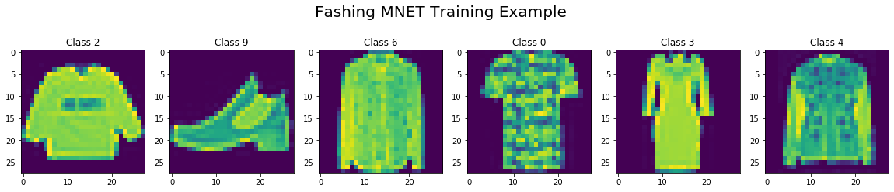
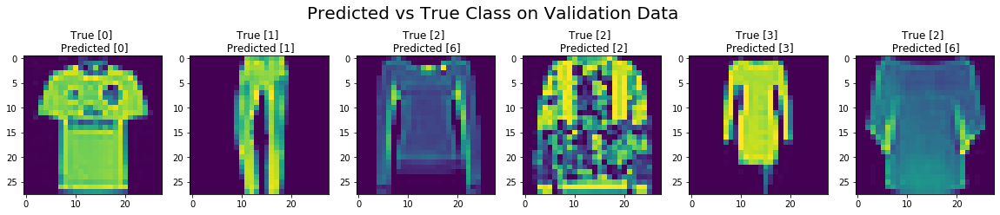

### Neural Network Training

In this tutorial, we will discuss how to bring all the different components of gluoncv together such as autograd, trainer, dataset, and dataloader, to train a custom network. 

In gluon, the way we accomplish this is by writing a training loop. 

We first import the libraries.

We also have ***mxnet.init*** for more parameter initialization methods, ***matplotlib*** for drawing, ***time*** for benchmarking. 


```python
from mxnet import nd, gluon, init, autograd, metric
from mxnet.gluon import nn
from mxnet.gluon.data.vision import datasets, transforms

import matplotlib.pyplot as plt
from time import time
```

#### Get Data

First let us get the dataset that we will train on.
Here, we'll use a dataset called fashion m-nest, and the goal is to classify claudine types. 

The dataset can be automatically downloaded through gluonsdata.vision.datasets module. 

The following code downloads the training dataset and shows the properties of the first example. 

Each example in this dataset is a 28 by 28 sides gray image which is presented as an NDRA with the shape format of height times width times channel. The label is a scalar.


```python
mnist_train = datasets.FashionMNIST(train=True)
x, y = mnist_train[0]

print('X shape: %s dtype : %s' % (x.shape, x.dtype))
print('Number of images: %d'%len(mnist_train))
```

    X shape: (28, 28, 1) dtype : <class 'numpy.uint8'>
    Number of images: 60000


#### Visualize the data

Let us visualize the first six images. We can see that they are low fidelity images of clothing items such as pullover, ankle boot, shirt, t-shirt, dress and coat. 


```python
fig, axes = plt.subplots(1,6, figsize=(20, 4))
fig.suptitle("Fashing MNET Training Example", fontsize=20)
for idx in range(6):
    axes[idx].imshow(mnist_train[idx][0][:,:,0].asnumpy())
    axes[idx].set_title('Class {}'.format(mnist_train[idx][1]))
```





#### Transform The Data

In order to feed data into a gluon network, we need to convert the images to the channel height times width, tensor format with floating point data type which can be done by ***transforms.totensor***. 

In addition, we normalize all pixel values with transform that normalize with the mean 0.13 and standard deviation 0.31. 

We chain these two transforms together using transform that ***compose*** and apply it to the first element of the data pair, namely the images.


```python
transformer = transforms.Compose([transforms.ToTensor(), transforms.Normalize(0.13, 0.31)])

mnist_train = mnist_train.transform_first(transformer)
```

#### Data Loading
Fashion m-nest is a subclass of gluon.data.dataset. 
In order to use it in training, we need to feed in randomized batches of examples through the network which can be easily done by a gluon dataloader. 

Here we use a batch size of 256 and four workers to process data in parallel which is often necessary especially for complex data transforms. 

The returned train data is an iterator that yields batches of images and label pairs.


```python
batch_size = 256
train_data = gluon.data.DataLoader(mnist_train, batch_size=batch_size, shuffle=True, num_workers=4)

for data, label in train_data:
    print(data.shape, label.shape)
    break
```

    (256, 1, 28, 28) (256,)


#### Define the Model
We implement the LeNet network; a convolutional neural network structure proposed by Yann LeCun et al. in 1998. In general, LeNet refers to lenet-5 and is a simple convolutional neural network.  


The LeNet5 model consists of two convolution, then MaxPooling block followed by a series of dense layers with 'relu' activations for the convolutional layers, and all but the last dense layer. 

One difference here is that we change the weight initialization method to Xavier which is a popular choice for deep convolutional neural networks.


```python
LeNet5 = nn.Sequential()
with LeNet5.name_scope():
    LeNet5.add(
            nn.Conv2D(channels=6, kernel_size=5, activation='relu'),
            nn.MaxPool2D(pool_size=2, strides=2),
            nn.Conv2D(channels=16, kernel_size=3, activation='relu'),
            nn.MaxPool2D(pool_size=2, strides=2),
            nn.Flatten(),
            nn.Dense(120, activation='relu'),
            nn.Dense(84, activation='relu'),
            nn.Dense(10)
    )
LeNet5.initialize(init=init.Xavier())
```

#### Loss Function

Beside the neural network, we need to define the loss function that is minimized during training. 

We will use standard softmax cross entropy for the classification problem. It first performs softmax on the output to obtain the predicted probability and then compares the label with the cross entropy. 

The cross entropy will be high when the true class is assigned a low probability.


```python
softmax_cross_entropy = gluon.loss.SoftmaxCrossEntropyLoss()
```

#### Metric (Accuracy)
We also define an accuracy metric to measure the performance of the network as we train. To compute accuracy, we simply need to compare our model outputs or predictions to the ground truth label and compute what fraction of the outputs match the label. 

Mxnet has a predefined metrics library and we can just use the accuracy class defined there.


```python
train_acc = metric.Accuracy()
```

#### Trainer/Optimization
We also need to define the gluon trainer that updates the model parameters during training. The optimization method we pick is the standard stochastic gradient descent method with constant learning rate of 0.1. 

The trainer is created with all parameters in the network. Later on, we only need to call the step method of the trainer to update the network widths.


```python
trainer = gluon.Trainer(LeNet5.collect_params(), 'sgd',{'learning_rate':0.1})
```

#### Training Loop
Now we can implement the complete training loop. 

We will go through 10 epochs of training which means that we will iterate over the entire dataset 10 times, and for each epoch, we will record the training loss, training accuracy, and training speed. The training loop over batches occurs within the epoch loop. 

We iterate over the training data loader obtaining batches of training data and training labels. Using the autograd record scope, we compute the model forward pass. First we obtain the result of feeding the data batch to the network, and then we compute the loss using the network output and training level. This executions are performed within autograd so that the operations are recorded, ready for the backward pass when the gradients are calculated. This is done by calling the backward function on the loss as we have seen in previous sections. 

Finally, we can update parameters of the network using the computer gradients by calling ***trainer.step***. This completes the training process on a single batch.

Before moving onto the next batch in the epoch, we record the training loss and training accuracy for housekeeping purposes. At the end of each training epoch, we also print the loss in accuracy after that epoch. 


```python
for epoch in range(10):
    train_loss = 0
    tic = time()
    for data, label in train_data:
        with autograd.record():
            output = LeNet5(data)
            loss = softmax_cross_entropy(output, label)
        loss.backward()
        
        trainer.step(batch_size)
        
        train_loss += loss.mean().asscalar()
        train_acc.update(label, output)
    
    print("Epoch [%d] Loss:%.3f Acc:%.3f"%(epoch, train_loss/len(train_data), train_acc.get()[1]))

LeNet5.save_parameters("trained_LeNet5.params")
```

    Epoch [0] Loss:0.266 Acc:0.900
    Epoch [1] Loss:0.258 Acc:0.902
    Epoch [2] Loss:0.252 Acc:0.903
    Epoch [3] Loss:0.244 Acc:0.905
    Epoch [4] Loss:0.234 Acc:0.906
    Epoch [5] Loss:0.232 Acc:0.907
    Epoch [6] Loss:0.225 Acc:0.908
    Epoch [7] Loss:0.218 Acc:0.910
    Epoch [8] Loss:0.213 Acc:0.911
    Epoch [9] Loss:0.212 Acc:0.912


As we can see, the loss is reducing after each epoch and the accuracy is increasing showing that a training process is working and the model is learning. 

After 10 epochs, we're able to get to about 91 percent accuracy on the training data. 

We save the model parameters with the safe parameters method after the 10 epochs of training. 

This does the parameter at the current state of training in the params file. 


### Evaluate the model

We saved all the parameters into a file ***trained_LeNet5.params***. 

#### Load trained parameter
Now, let's load it back. To load parameters to a network from an params file, we can simply use the load parameters method of the network or any glue and block. 


```python
LeNet5.load_parameters('trained_LeNet5.params')
```

#### Prediction
We will evaluate the trained model by running some predictions with it. 

#### Validation Data
Before we can run predictions, we need a dataset, specifically one that model has not yet seen. 

We can use the validation or test splits of the fashion eminence dataset for our evaluation. We can select it by setting the trend keyword argument to false. 


```python
mnist_val = datasets.FashionMNIST(train=False)
```

#### Data Transformation

Remember the Data transformation we did for training. 

Now, we need exactly the same transformation for predicting. The data transformation consists of composing two transformations. 
1. Convert the input images to tensors
2. Normalize the images using the mean and standard deviation. 


```python
transform_fn = transforms.Compose([
                transforms.ToTensor(), 
                transforms.Normalize(0.13, 0.31)])
```

#### Prediction

Now, let's try to predict the first six images in the validation dataset, and stop predictions into preds.

To do this, we iterate over each image that we want to predict. 

First, we apply the transformation and add an extra dimension for the batch size that our network is expected. 

Next, we get the network predictions for each class, and we can take the argmax to get the class that the network assigns the IRS confidence to. 

We can then start the prediction so that we can compare it to the validation level. 


```python
preds = []
for idx in range(6):
    image, label = mnist_val[idx]
    image = transform_fn(image).expand_dims(axis=0)
    pred = LeNet5(image).argmax(axis=1)
    preds.append(pred.astype('int32').asscalar())
print(preds)
```

    [0, 1, 6, 2, 3, 6]


#### Visualize Result

We can visualize the images that we predicted and the ground truth label at the top compared to the network predictions at the bottom. 

We see that the network mostly it does a good job of predicting the right fashion classes for the items, or make some errors mistaking a class 2 with class 6.


```python
fig, axes = plt.subplots(1,6, figsize=(20, 4))
fig.suptitle("Predicted vs True Class on Validation Data", fontsize=20)
for idx in range(6):
    axes[idx].imshow(mnist_val[idx][0][:,:,0].asnumpy())
    axes[idx].set_title('True [{}] \n Predicted [{}]'.format(mnist_val[idx][1], preds[idx]))
```





#### Validation Data Loader

However, we just evaluated the model on a subset of the validation data. 

To use the entire validation dataset, we can create a validation data load just like we did during training. 

We said a batch size of 256 similar to the train data loader, and apply the same transformation. But we do not have to shuffle because we're not training the network. 

We also need to define the metric we will be using to evaluate the model performance. Since we used accuracy during training, we will use the same for validation. We can simply use the accuracy metrics class from the MxN matrix Package. 


```python
batch_size = 256
val_data =gluon.data.DataLoader(mnist_val.transform_first(transform_fn), batch_size=batch_size, num_workers=4)

val_acc = metric.Accuracy()
```

#### Validation Loop

Now, we can implement the complete validation loop. 

We just need to go through the validation data load or wants unlike in training where we perform multiple a batch.

For each batch of data and the validation dataset, we use the model to make a batch of predictions. 

We can then compute the accuracy of the model using the model's output and the ground truth validation liberal. 

Sum in this for each batch, and dividing by the number of batches, gives the models average accuracy. 


```python
for data, label in val_data:
    output = LeNet5(data)
    val_acc.update(label, output)
print("Validation Accuracy: %0.3f"%(val_acc.get()[1]))
```

    Validation Accuracy: 0.901


For the model that we trained, we can see that the validation accuracy of 90 percent is very close to the training accuracy of 91 percent. 

Meaning that the model does a good job generalizing to new examples.
