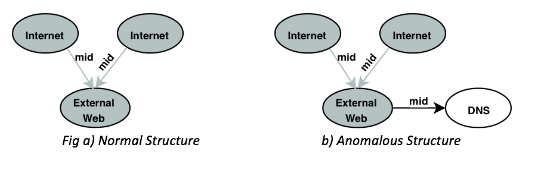

    
    

A denial-of-service (DoS) attack is a malicious act
with the goal of interrupting the access to a computer network.
The result of this type of attack can cause the computers on the
network to squander their resources to serve illegitimate requests
that result in a disruption of the network’s services to legitimate
users. With a sophisticated DoS attack, it becomes difficult to
distinguish malicious requests from legitimate requests. Since a
network layer DoS attack can cause interruptions to a network
while causing collateral damage, it is vital to understand the
measures to mitigate against such attacks. Generally, approaches
that implement distribution charts based on statistical analysis or
honeypots have been applied to detect a DoS attack. However, this
is usually too late, as the damage is already done. We hypothesize
in this work that a graph-based approach can provide the
capability to identify a DoS attack at its inception. A graph-based
approach will also allow us to not only focus on anomalies within
an entity (like a computer), but also allow us to analyze the
anomalies that exist in an entity’s relationship with other entities,
thus providing a rich source of contextual analysis. We
demonstrate our proposed approach using a publicly-available
data set.
