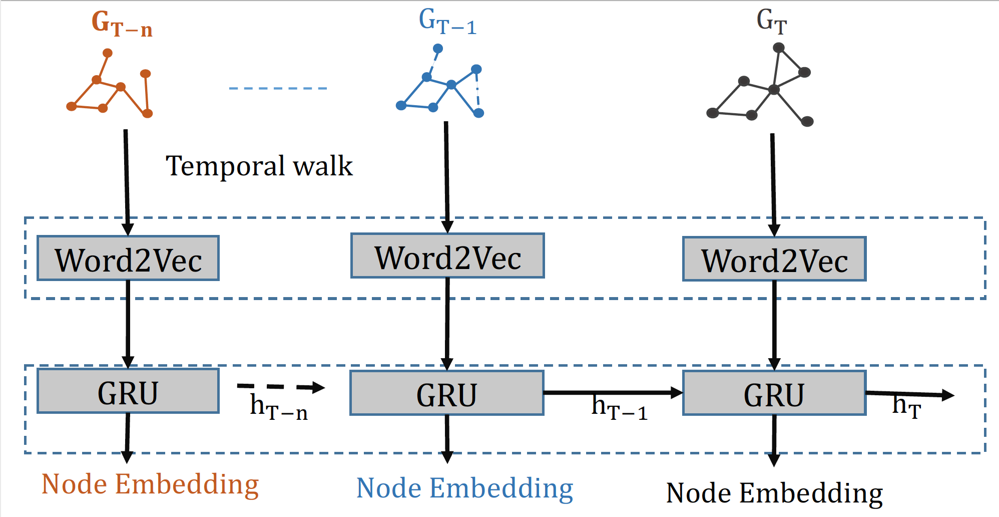

***Dynamic Graph Embedding***
In this project, we propose a novel embedding technique for dynamic graph that capture the short-term as well as long-term temporal information. The majority of the dynamic graph embedding technique has focused on static snapshots of the graph and has largely ignored the temporal dynamics within a single snapshot. Representing dynamic graph as a sequence of static snapshots where each snapshot represents all edges that occurs between a discrete time interval (e.g. minute, hour, or day) can be very coarse and noisy approximation of actual time dynamic. For example, in graph stream with edges arriving continuosly with high rate (every second/millisecond) selecting higher time granularity (e.g. minute, hour, or day) may result in loss of information and lead to poor predictive performance. Therefore, we propose to use the concept of temporal walk to capture the smallest time granularity within a snapshot. A temporal random walk traverse a graph in a increasing order of edge times. The sequence of nodes generated using temporal walk carries important information. For example, if the edge (or link) represents an email communication sent from one user to another, then the state of the user who receives the email message changes in response to the email communication.

    

Given the success of techiques like DeepWalk, Walklet, Node2Vec that utilizes Skip-Graph langugage model,
temporal walk is given as an input to a word2vec  model that returns node representations with the maximum likelihood of preserving node neighborhoods (spatial) as well as short-term temporal dependencies in a d-dimensional feature space. However, the framework can easily be used for other deep graph models that leverage random walks as the temporal walks can serve as input vectors for neural networks. We then plan to extend it to the dynamic setting through introducing a recurrent mechanism to update the network parameters, for capturing the dynamism of the graphs. Figure above shows the proposed framework for the dynamic embedding. The time-dependent embeddings learned by the proposed approach based on temporal random walks, will avoid the issues and information loss that arises when time is ignored or modeled as a sequence of discrete static snapshots. We believe the proposed approach will be useful in cybersecurity for identifying advance persistance threat, lateral movement, reducing false positive, and other type of cyber attacks. In social network, the proposed dynamic embedding technique will be useful to study the birth and the evolution of communities specifically focusing on coordinated communities for spreading misinformation.

---
*** Graph Sketching***

    

In any application domain where the data are represents an entities and the relationship between
entities, e.g., web-page and hyperlinks; people and their friendship; papers and citations;
network devices and traffic flow; chemical compound and their bond, the graph is usually massive.
If a data have $$n$$ entities, it is essentially an $$O(n^2)$$ dimensional object.
Graph being ubiquitous standard for representing such relational data, impose a sheer challenge
to any learning algorithm because of it's size. In this work, we propose a novel unsupervised graph
representation approach in a graph stream called *SnapSketch* that can be used for anomaly detection.
It first performs a fixed-length random walk from each node in a network and constructs n-shingles
from a walk path. The top discriminative n-shingles identified using a frequency measure are projected
into a dimensional projection vector chosen uniformly at random. Finally, a graph is sketched into a
low-dimensional sketch vector using a simplified hashing of the projection vector and the cost of shingles.
Using the learned sketch vector, anomaly detection is done using the state-of-the-art anomaly detection
approach called Robust Random Cut Forest (RRCF). *SnapSketch* has several advantages, including fully unsupervised learning,
constant memory space usage, entire-graph embedding, and real-time anomaly detection.

