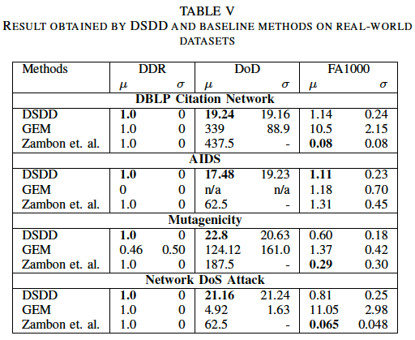

    

In a streaming graph model, the function which generates
instances at time step *t* need not be the same function as
the one that generates instances at time *t + 1* step. This
phenomenon of non-stationarity, where the data distribution
changes, is called concept drift. For example,
concept drift can be thought of as a change in user preferences
when watching a movie on [Netflix](https://www.netflix.com).
Though the distribution of the movies on [Netflix](https://www.netflix.com) often remains
the same, the choice of liking (or not liking) a specific genre
of a movie for that user can change over time. Thus, due to the
concept drift, the learning model built on the historical data can
be inconsistent with the current data, leading to a deterioration
of the model performance. Furthermore, human intervention
for class labeling is impractical as data flows continuously.
Also, class labeling is time-consuming, expensive, and infeasible
in some cases. Therefore, a real-time learning
model should be able to handle the streaming nature of data,
take concept drift into account and learn without an
explicit class label, i.e., learn in the unsupervised scenario.

In this research, we investigate an unsupervised approach for concept drift
detection in graph stream called **Discriminative Subgraphbased
Drift Detector (DSDD)**. The main idea is to
process the graph stream using a sliding window technique and
decomposing each graph into a number of discriminative subgraphs
that best compresses the graph using an MDL heuristic.
Then the entropy of the window based on the distribution
of discriminative subgraph, w.r.t. the graphs is computed, by
moving one step forward in the sliding window. The well
known direct density-ratio estimation approach called Relative
Unconstrained Least-Squares Importance Fitting (RuLSIF)
is employed for detecting concept drift in the entropy
series.

We performed several experiments on synthetic as well as real-world data to
demonstrate the effectiveness of the proposed approach. As
the baseline approaches employed different techniques then
ours, it was not a straight apples-to-apples comparison, but
the results show that our approach has its advantages. It
outperforms **Zambon et. al.** in all the real-world data sets
in terms of detection delay while attains a similar detection
rate and false alarm rate. Similarly, it outperform **GEM**
in three datasets in term of detection delay, detection rate
and false alarm rate. In addition, the unsupervised nature
of DSDD makes it more robust in a streaming scenario
and it’s competitive performance makes it a promising drift
detection technique on graph streams. We further applied the
proposed drift detection approach to the graph stream learning
technique and demonstrated its usefulness. Incorporating the
proposed drift detector significantly improved the performance
of each learning algorithms. Thus, we believe that the proposed
methodology can be used as a tool for drift detection by other
graph stream learning techniques for coping with concept drift.

For further detail, please refer the paper published in [The ACM Transactions on Knowledge Discovery from Data (TKDD)](https://dl.acm.org/doi/abs/10.1145/3406243).
---

    

