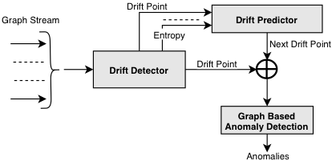

    
    

There are three key elements in this research as shown in the Fig 1.
- Concept Drift Detection:
Anomaly detection on streaming data have to take concept drift in account to be an effective approach. So, first step for effective anomaly detection on non-stationary (drifting) graph stream will be accompanied by a novel unsupervised drift detection approach in graph stream called Discriminative Subgraph based Concept Drift Detection on Graph Stream. In stream data, supervised concept drift detection is unfeasible because the data is collected at high frequencies and labeling is costly. The concept of the graph stream in any time (or window) is defined by the feature distribution (discriminative subgraph) over a time period (window). 

- Drift Prediction:
For efficient anomaly detection in graph stream, the anomaly detection model need to be retrained once the concept drift is detected to match the current distribution of the data. This retraining is a resource intensive both in term of time and memory. If the detection model is retrained after concept drift is detected, anomaly detection on the data after the change point to the end of retraining anomaly detection model is done using the model constructed from old distribution. Therefore, there is high chance that we will miss some anomalies because of outdated model.  In fraud detection world, these missed anomaly can be very crucial. This can be addressed by proactively prediction future drift and adjusting the model to match the distribution after drift as soon as the drift point is encountered. The task of concept drift prediction will be accomplished using a type of Recurrent Neural Network called Long-Short Term Memory. 

- Anomaly Detection on Graph Stream:
Graph stream are prone to concept drift. Any anomaly detection technique on graph stream have to take concept drift in account for better performance. We will develop the framework for effective anomaly detection on drifting graph stream, by taking current and future drift in accounts and adjusting the anomaly detection model accordingly.

---
