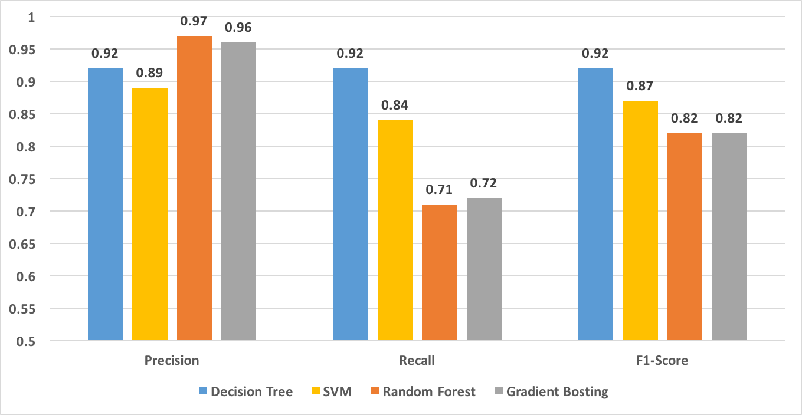

    

Most modern users of IoT devices are not aware of the security vulnerabilities of
these devices, and how that may affect the network on which they reside. This is
largely influenced by the fact that current software on a large number of IoT
devices have little to no significant security beyond a password that many users
often never change, leaving them vulnerable to attacks.
Most existing security solutions generate heavy computation and communication load for IoT devices,
and outdoor IoT devices such as cheap sensors with light-weight security protections are usually more
vulnerable to attacks than computer systems. This lack of substantial security
is made evident by a number of high profile hacks in recent years including
the late 2016 Mirai malware DDoS attacks  which utilized compromised IoT devices
 as part of a botnet to orchestrate large-scale attacks and the 2017 casino
 fish tank IoT thermometer hacking  which allowed hackers
 to pull sensitive customer data through the device to the cloud.

One possible approach for detecting anomalous behavior in connected, IoT devices, is through graphs. A graph provides a powerful representation of highly relational and inter-dependent nature of IoT network data in smart homes where each device can be treated as a node and the communication between devices as edges. The nature of anomalies in such a network could exhibit themselves as relational. For example in the case of a Distributed Denial of Service (DDoS) attack, one could imagine a scenario where a set of attack devices, in collaboration, are sending a high amount of traffic towards a single device. This scenario points to relational nature of anomalies which is hard to detect using traditional machine learning tools, and more readily detected using a graph-based approach. Another advantage to utilizing a graph-based approach is that we do not need any extra information like packet size, protocol etc. because the graph uses only communication between source and destination device. This is important particularly in situations where a network may be encrypted and approaches which rely on features such as protocol, and packet size can not be used.

In this paper, we propose to represent a real time smart home IoT network as a graph stream.
A normative pattern or behavior at any time in the IoT network would represent
the expected traffic flow in a smart home, while deviations from the expected
traffic flow (like a DoS attack) would constitute an anomaly. To address the problem
 of DoS attack detection in smart home IoT devices, we introduce a new graph-based
anomaly detection approach called GODIT that (i) can handle graphs representing smart
homes traffic in real-time, (ii) efficiently processes graph data,
minimizing run-time performance and memory, and (iii) detects DoS attack
in real-time. We propose a fixed size sketch-based representation of a
graph using a n-shingle constructed from a walk path of a random walk in
a graph. The fixed sized sketch vector will contain the frequency of
the top discriminative n-shingle. Finally, the sketch vector will be
used for DoS attack detection using a standard machine learning approach.

---

    

