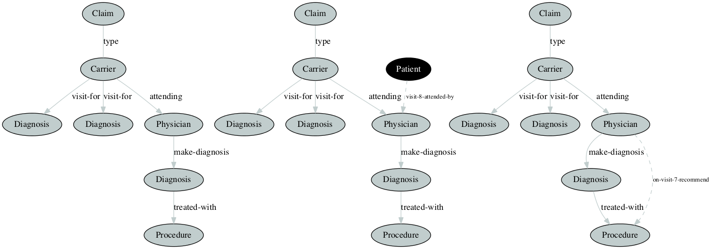

Every year, billions of dollars are lost due to fraud in the U.S. health care system. Health care claims are complex as they involve multiple parties including service providers, insurance subscribers, and insurance carriers. Medicare is susceptible to fraud because of this complexity. To build a comprehensive fraud detection system, one must take into consideration all of the financial practices involved among the associated parties. Various types of health-care fraud schemes are briefly described as follows:
1. **Identity Theft:** Stealing identification information from providers or beneficiaries and using that information to submit fraudulent bills to Medicare.
2. **Phantom Billing:** Billing for services that are not actually performed.
3. **Unbundling:** Billing each stage of a procedure as if it were a separate treatment.
4. **Upcoding:** Billing costlier services than the performed.
5. **Bill Padding:** Providing medically excessive or unnecessary services to a patient.
6. **Duplicate Billing:** Submitting same claims multiple times
7. **Kickbacks:** A negotiated bribery in which a commission is paid to the bribe-taker (provider or patient) as a quid pro quo for services rendered.
8. **Doctor shopping:** Patient consults many physicians in order to obtain multiple prescriptions of drugs in excess of their own therapeutic need.

    
    <em>Fig. Normal and Anomalous Graph Structure Discovered</em>  
    

   
This work is focused on graph-based analysis of CMS provided Medicare claims data to look for above anomalies by analysing the relationships and transactions among patients, service providers, claims, physicians, diagnosis, and procedures. 
In our experiments, we create graphs from inpatient, outpatient, and carrier claims data of the beneficiary. We then demonstrate the potential effectiveness of applying graph-based anomaly detection to the problem of discovering anomalies and potential fraud scenarios.
For details please refer the paper published at [FLAIRS-30 Conference Preceeding](https://aaai.org/ocs/index.php/FLAIRS/FLAIRS17/paper/view/15455/14978)
