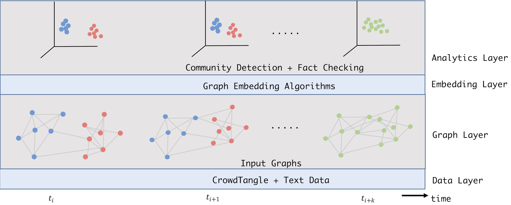

    

Many questionable sources such as The Daily Wire and The Western Journal have
frequently violated Facebook’s rules by engaging in covert coordinated sharing behavior. This strategy was often used to artificially boost the reach of problematic content. However, we lack basic understanding of this
phenomenon. How prevalent is it? What kind of information is shared through coordinated
campaigns? The Investigation Cluster partners with the Graph Computing Lab to conduct a systemic
analysis of coordinated sharing behavior on Facebook. Empowered by graph-based machine
learning techniques, our analysis uses a list of 40,000 most followed pages that account for over
95% of total engagement on Facebook. We intend our analysis to occur in three main stages.
First, we will provide an overview of the scale of coordinated link sharing behavior. Second, we
will identify its major topics and determine if it is associated with problematic information
sharing. Third, we will identify various coordination networks and examine how they evolve over
time as new topics of interest emerge.

This project has two practical implications. First, our assessment of coordinated sharing
behavior on Facebook has a high potential to shape public policy, including ongoing or imminent
legal action against Facebook. Failure to adequately prevent coordinated activity would be the
kind of critical harm highlighted by the recent antitrust suit filed against Facebook (FTC,
2020). Second, the project can help develop solutions to combat disinformation and foreign
interference, through the identification of both common operational patterns and specific
coordination networks involving malicious actors.